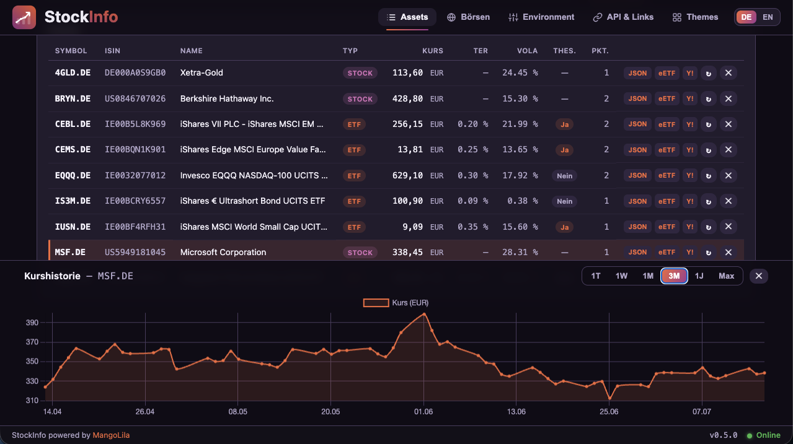
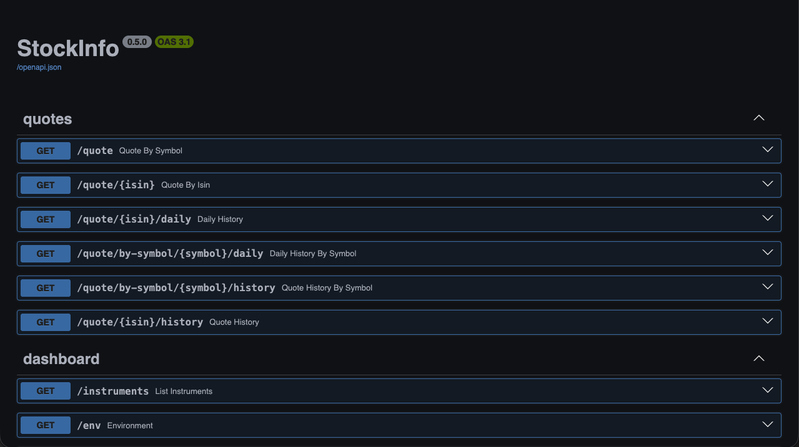

# StockInfo

A small app that serves **stock and ETF quotes via a REST API** and caches them in a
**SQLite database**. Query by **ISIN** or by **symbol + exchange**; the response is
**JSON** with price, currency, timestamp, name and — for ETFs — extras such as TER,
provider and fund size.

It ships with a **web dashboard** (Vue): asset overview with sortable columns,
configuration view, exchange legend, 8 switchable themes, German/English UI, a price
chart (intraday **and** real end-of-day closes) that docks at the bottom of the
viewport, plus per-asset actions (refresh, delete, add ISIN) and links (extraETF,
Yahoo Finance, JSON export).



## Contents

- [What can it do?](#what-can-it-do)
- [How quotes are fetched](#how-quotes-are-fetched)
- [Requirements](#requirements)
- [Quick start](#quick-start)
- [The REST API](#the-rest-api)
- [Configuration (.env)](#configuration-env)
- [Dashboard](#dashboard)
- [Docker](#docker)
- [Unraid](#unraid)
- [Tests](#tests)
- [Project layout](#project-layout)

---

## What can it do?

- **Fetch quotes** — European **and** US stocks/ETFs, by ISIN or symbol.
- **Cache** — every response is stored in SQLite; repeated requests are served from
  the cache instead of hitting the internet again.
- **Stay up to date automatically** — a background job refreshes all known
  instruments at a configurable interval.
- **History** — two views: the **intraday curve** built from collected ticks, and
  real **end-of-day closes** (EOD from Yahoo, cached incrementally — each request
  only fetches the missing delta).
- **Rich data** — besides price and timestamp: name, currency, volume, volatility,
  and for ETFs TER, provider, replication method, fund size and
  accumulating/distributing.
- **Dashboard** — overview with column sorting, docked price chart, 8 themes,
  German/English UI, exchange legend, profile links, JSON export.

[↑ Contents](#contents)

---

## How quotes are fetched

The app combines three **free** data sources:

| Source | Used for |
|---|---|
| **yfinance** (Yahoo Finance) | price, currency, volume, name, EOD closes (basis of the computed volatility) — stocks & ETFs, EU & US |
| **justETF** | ETF extras: TER, provider, replication, fund size, 1-year volatility, distribution policy |
| **OpenFIGI** | resolves an ISIN to the listing at your preferred exchange (default: Xetra → EUR) |

**A note on currency:** the exchange suffix selects the exchange, not the currency —
the currency always comes from the live quote. Example: the same ISIN trades on
Xetra in EUR, in London often in pence (GBp). The app returns the currency verbatim.

[↑ Contents](#contents)

---

## Requirements

- **Python 3.11+** (the app creates its own `.venv`)
- **make** (drives start/stop of the services)
- optional **Docker** (to run the container)
- optional **Node.js 20+** (dashboard only)

The project uses shared ecosystem helpers under `.libs/` (MakeLib, BashLib). For the
Makefile the environment variable `DEV_MAKE` must point to the MakeLib.

[↑ Contents](#contents)

---

## Quick start

```bash
# 1. Create the configuration
cp .env.example .env

# 2. Install dependencies (once)
python3.11 -m venv .venv
.venv/bin/pip install -r requirements-dev.txt

# 3. Start the server
make dev            # backend only, foreground (auto-reload)
#   or
make start          # backend only, background   →  make stop / make logs
```

The whole stack (backend **and** dashboard) at once — via
[overmind](https://github.com/DarthSim/overmind):

```bash
make dev-up         # backend :8000 + dashboard :5173
make dev-down       # stop both   ·   make dev-logs for logs
```

The server then runs at `http://localhost:8000`. Interactive API docs (Swagger UI,
dark theme) live at `http://localhost:8000/docs` (use `http://` in the browser, not
`https://`).

First query:

```bash
curl http://localhost:8000/quote/IE00B3RBWM25
```

`make help` lists all available commands, `make hints` shows useful URLs.

[↑ Contents](#contents)

---

## The REST API



| Method & path | Purpose |
|---|---|
| `GET /health` | health check (status + version) |
| `GET /quote/{isin}` | quote by ISIN (prefers Xetra/EUR) |
| `GET /quote?symbol=VGWL.DE` | quote by full Yahoo symbol (suffix = exchange) |
| `GET /quote/{isin}/history` | intraday history (collected ticks) |
| `GET /quote/{isin}/daily?period=1w\|1m\|3m\|1y\|max` | real end-of-day closes (EOD, cached) |
| `GET /instruments` | all cached instruments with their latest quote |
| `GET /env` | current configuration (secrets masked) |
| `POST /refresh` · `POST /refresh/{isin}` | refresh all / a single instrument |
| `PUT /instruments/by-symbol/{symbol}/isin` | add an ISIN after the fact |
| `DELETE /instruments/{isin}` | delete an instrument including its history |

For instruments **without an ISIN** there is a `…/by-symbol/{symbol}` variant of
each endpoint (quote, history, daily, refresh, delete).

**Example response** (`GET /quote/IE00B3RBWM25`):

```json
{
  "isin": "IE00B3RBWM25",
  "symbol": "VGWL.DE",
  "exchange": "Xetra",
  "name": "Vanguard FTSE All-World UCITS ETF",
  "type": "etf",
  "currency": "EUR",
  "price": 160.98,
  "quote_time": "2026-07-10T15:35:46+00:00",
  "volume": 14403,
  "ter": 0.19,
  "provider": "Vanguard",
  "replication": "Physical(Optimized sampling)",
  "fund_size": 22638.0,
  "volatility": 9.95,
  "accumulating": false,
  "source": "yfinance+justetf",
  "cached": false,
  "stale": false,
  "fetched_at": "2026-07-12T18:16:28+00:00"
}
```

`volatility` is the 1-year volatility in percent — from justETF for ETFs, otherwise
computed (annualized) from the cached EOD closes. `accumulating` states whether an
ETF accumulates (`true`) or distributes (`false`).

Fields that cannot be determined are `null` (e.g. `ter` for individual stocks). If a
live fetch fails but an old value exists in the cache, that value is returned with
`"stale": true` instead of an error. Unknown ISIN → `404`.

[↑ Contents](#contents)

---

## Configuration (.env)

All values can be overridden via `.env` (`cp .env.example .env`):

| Variable | Meaning | Default |
|---|---|---|
| `HOST` / `PORT` | server address | `0.0.0.0` / `8000` |
| `DATABASE_PATH` | path of the SQLite file | `data/stockinfo.db` |
| `CACHE_TTL_HOURS` | age at which a quote is re-fetched on request | `6` |
| `REFRESH_INTERVAL_HOURS` | interval of the background refresh | `6` |
| `METADATA_TTL_DAYS` | refresh cadence for ETF metadata | `7` |
| `DEFAULT_EXCHANGE` | preferred exchange for ISIN queries (MIC) | `XETR` (Xetra) |
| `OPENFIGI_API_KEY` | optional key for a higher OpenFIGI rate limit | empty |
| `EXTRAETF_ETF_URL` / `EXTRAETF_STOCK_URL` | profile link templates (placeholder `{isin}`) | extraetf.com/… |
| `YAHOO_URL` | Yahoo link template (placeholder `{symbol}`) | de.finance.yahoo.com/… |
| `CORS_ORIGINS` | allowed dashboard origin(s) | `http://localhost:5173` |

[↑ Contents](#contents)

---

## Dashboard

A standalone web frontend lives in [`dashboard/`](dashboard/) (Vue 3 + Vite +
TypeScript + SCSS) with a fixed header (deep-linkable tab navigation, **DE/EN
language switch** — persisted, initial language follows the browser) and a status
bar (**health traffic light** green/orange/red + version):

- **Assets** — overview with the latest quote and **sortable columns** (click a
  header: ascending → descending → off; persisted); add (ISIN/symbol), refresh,
  delete, **add ISIN**; per row links to **extraETF**, **Yahoo Finance** and a
  **JSON popup** (URL + result copyable — works on plain `http://` too).
- **Chart** — selecting a row docks the price history at the bottom of the
  viewport (always visible, even with long asset lists). Range switch
  `1D · 1W · 1M · 3M · 1Y · Max`: `1D` = intraday curve (collected ticks), the rest
  are real end-of-day closes (EOD). True time axis, compact ticks.
- **Exchanges** — legend of the Yahoo suffixes (exchange, region, currency).
- **Environment** — current configuration incl. a note on the automatic refresh;
  **Themes** — 8 selectable, persisted themes.

```bash
cd dashboard
npm install
npm run dev                # http://localhost:5173
```

The Vite dev proxy forwards API requests to the backend (`http://localhost:8000`)
automatically — `VITE_API_BASE_URL` is not needed in dev (optionally overridable,
see `dashboard/vite.config.ts`).

The backend must run in parallel. Both together: **`make dev-up`** (see Quick start).

[↑ Contents](#contents)

---

## Docker

Backend **and** dashboard run in a single image on one port. Built with
`docker/build.sh` (ecosystem convention, versioned via `gitDockerTag`):

```bash
make build     # build the image (docker/build.sh --build)
make up        # start the container → http://localhost:8000/
make down      # stop & remove
make docker-logs   # follow logs
```

FastAPI serves the dashboard itself (relative API calls) — no separate web server
required. The cache lives in the `stockinfo-data` volume (`/data` inside the
container). The container runs as a non-root user (UID 99 / GID 100 — Unraid's
`nobody:users`).

**Push to a registry:**

```bash
make push                     # docker/build.sh --push   (TARGET=dockerhub, default)
TARGET=ghcr make push         # alternatively GitHub Container Registry
```

[↑ Contents](#contents)

---

## Unraid

A ready-made container template lives at
[`unraid/stockinfo.xml`](unraid/stockinfo.xml) — image `mangolila/stockinfo:latest`
(Docker Hub), WebUI port `8000`, path `/mnt/user/appdata/stockinfo → /data`, plus
the most important settings as variables (refresh interval, TTLs, exchange,
OpenFIGI key, timezone).

Install it as a user template (run on the Unraid box):

```bash
wget -O /boot/config/plugins/dockerMan/templates-user/my-stockinfo.xml https://raw.githubusercontent.com/MikeMitterer/stockinfo/master/unraid/stockinfo.xml
```

Then: **Docker → Add Container** → pick “stockinfo” under *User templates*.
Support: [GitHub Issues](https://github.com/MikeMitterer/stockinfo/issues).

[↑ Contents](#contents)

---

## Tests

```bash
make test                       # backend (pytest)
cd dashboard && npm run test    # dashboard (Vitest)
```

The tests run without network access — external data sources are mocked.

[↑ Contents](#contents)

---

## Project layout

```
app/                    # FastAPI backend
  main.py               #   app setup, routes, scheduler startup
  config.py             #   configuration (.env)
  db.py, repository.py  #   SQLite: schema and data access
  resolver.py           #   ISIN → symbol/exchange (OpenFIGI + Yahoo)
  providers/            #   data sources: yfinance, justETF, OpenFIGI
  services/             #   quote fetching + cache/TTL logic
  scheduler.py          #   periodic background refresh
  routers/              #   HTTP endpoints (quotes, dashboard)
  docs.py               #   dark-themed Swagger UI (/docs)
dashboard/              # Vue dashboard (standalone app)
tests/                  # backend tests (pytest)
docker/                 # Dockerfile, build.sh (single-image build)
unraid/                 # Unraid CA template (+ screenshots)
Makefile                # service start/stop (make help)
```

Technical details and design decisions: see
[`docs/superpowers/specs/`](docs/superpowers/specs/).

[↑ Contents](#contents)
