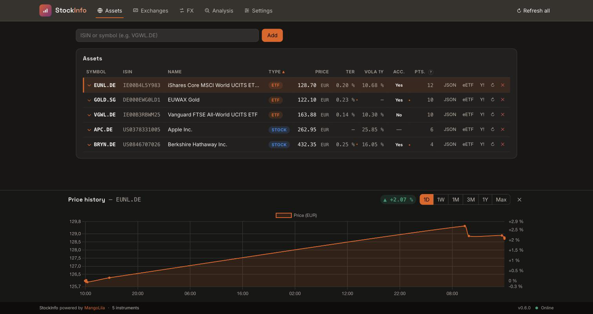
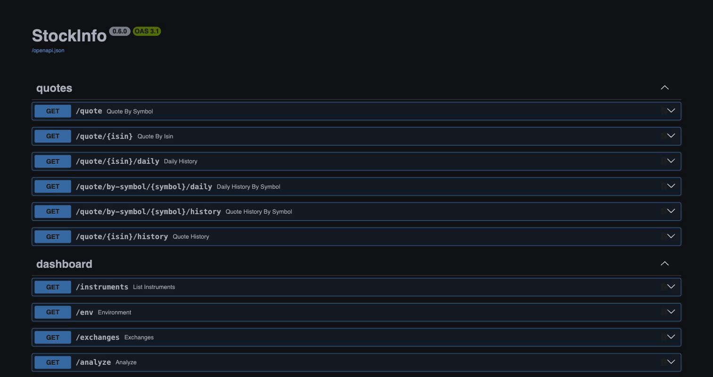

# StockInfo

A small app that serves **stock and ETF quotes via a REST API** and caches them in a
**SQLite database**. Query by **ISIN** or by **symbol + exchange**; the response is
**JSON** with price, currency, timestamp, name and — for ETFs — extras such as TER,
provider and fund size.

Docker image: [mangolila/stockinfo on Docker Hub](https://hub.docker.com/repository/docker/mangolila/stockinfo/general).

The **web dashboard** provides an asset overview, price charts, manual ETF
metrics and source configuration, with German and English UI.



### What's new in 1.1.0

- `GET /instrument-types` lists the asset types declared by the configured
  plugins, including source status and whether the catalog is complete.
- `GET /fields` describes core and plugin fields in English, independently of
  the dashboard language or `Accept-Language`.
- The dashboard development proxy also forwards `/instrument-types`.

Earlier changes: [release notes](docs/release-notes.md).

## Contents

- [What can it do?](#what-can-it-do)
- [How quotes are fetched](#how-quotes-are-fetched)
- [Requirements](#requirements)
- [Quick start](#quick-start)
- [Security model](#security-model)
- [The REST API](#the-rest-api)
- [Configuration (.env)](#configuration-env)
- [Dashboard](#dashboard)
- [Docker](#docker)
- [Unraid](#unraid)
- [Tests](#tests)
- [Project layout](#project-layout)
- [License](#license)

---

## What can it do?

- **Fetch quotes** — European **and** US stocks/ETFs, by ISIN or symbol.
- **Cache** — every response is stored in SQLite; repeated requests are served from
  the cache instead of hitting the internet again.
- **Stay up to date automatically** — a background job refreshes all known
  instruments at a configurable interval.
- **History** — two views: the **intraday curve** built from collected ticks, and
  real **end-of-day closes** (EOD from Yahoo, cached incrementally — each request
  only fetches the missing delta).
- **Rich data** — besides price and timestamp: name, currency, volume, volatility,
  and for ETFs TER, provider, replication method, fund size, fund domicile,
  fund currency and accumulating/distributing.
- **Fill the gaps yourself** — whatever the sources do not deliver can be entered by
  hand in the expandable detail area of a row. The source always wins: a manual
  value fills a gap, it never overwrites. It stays stored while the source covers
  it and applies again as soon as the source goes quiet. This is the intended route
  for TER and fund size of non-European ETFs, which no free source states reliably.
- **Dashboard** — overview with column sorting, docked price chart, 8 themes,
  German/English UI, exchange legend, profile links, JSON export.

[↑ Contents](#contents)

---

## How quotes are fetched

The default online chains use these **free** data sources:

| Source | Used for |
|---|---|
| **yfinance** (Yahoo Finance) | price, currency, volume, name, EOD closes (basis of the computed volatility) — stocks & ETFs, EU & US. Also the fund provider for **non-European ETFs**, which justETF does not list |
| **justETF** | ETF extras for **European** (UCITS) funds: TER, provider, replication, fund size, 1-year volatility, distribution policy |
| **OpenFIGI** | resolves an ISIN to the listing at your preferred exchange (default: Xetra → EUR) |
| **Yahoo search** | fallback for resolving instruments when OpenFIGI cannot resolve them |

Source chains are configurable in `sources.yaml` beside the database.
The bundled `yaml-file` plugin can supply manually maintained data as a
fallback or as a file-only profile. See [source configuration](docs/plugins.md)
and the [plugin author guide](docs/plugin-authors.md).

**ETFs outside Europe.** justETF is a database of European UCITS funds, so a US or
Canadian ETF finds nothing there. For those, Yahoo supplies the fund provider —
and deliberately nothing else: it reports the expense ratio in two fields with two
different units (`0.03` vs `0.0003` for the same fund) and the fund size in local
currency, while this app stores millions of EUR. A wrong number would be worse than
none, because a value from a source *hides* one you entered by hand instead of
leaving the gap open. So TER, fund size and domicile stay empty for those funds —
enter them yourself and they stay put.

**A note on currency:** the exchange suffix selects the exchange; the currency
comes from the quote. The current Yahoo plugin rejects pence codes such as
`GBp` instead of converting them to `GBP`. Yahoo daily prices are adjusted for
splits and dividends. Both behaviors differ from the REST artifact; see the
[known contract differences](docs/rest-core-contract.md#die-begriffe-die-sich-sonst-niemand-erschließt).

[↑ Contents](#contents)

---

## Requirements

- **Python 3.11+** (the app creates its own `.venv`)
- **make** (drives start/stop of the services)
- optional **Docker** (to run the container)
- optional **Node.js 20+** (dashboard only)

The project uses shared ecosystem helpers under `.libs/` (MakeLib, BashLib). For the
Makefile the environment variable `DEV_MAKE` must point to the MakeLib.

[↑ Contents](#contents)

---

## Quick start

```bash
# 1. Create the configuration
cp .env.example .env

# 2. Install dependencies (once)
python3.11 -m venv .venv
.venv/bin/pip install -r requirements-dev.txt

# 3. Start the server
make dev            # backend only, foreground (auto-reload)
#   or
make start          # backend only, background   →  make stop / make logs
```

The whole stack (backend **and** dashboard) at once — via
[overmind](https://github.com/DarthSim/overmind):

```bash
make dev-up         # backend :8000 + dashboard :5173
make dev-down       # stop both   ·   make dev-logs for logs
```

The server then runs at `http://localhost:8000`. Interactive API docs (Swagger UI,
dark theme) live at `http://localhost:8000/docs` (use `http://` in the browser, not
`https://`).

First query:

```bash
curl http://localhost:8000/quote/IE00B3RBWM25
```

`make help` lists all available commands, `make hints` shows useful URLs.

[↑ Contents](#contents)

---

Plugin data migrations run automatically before normal operation when an
active source increases its `data_version`. StockInfo backs up first and commits
each migration together with its new version. Failed or missing migrations
block business requests and refreshes; the server log identifies the plugin,
versions and cause. See [plugin data migrations](docs/plugin-authors.md#plugin-data-migrations).

## Security model

**StockInfo has no authentication, and it is not meant to have one.** Every
endpoint is open to anyone who can reach the port — including the ones that
change or destroy data:

- `DELETE /instruments/{isin}` removes an instrument together with its entire
  price history.
- `PUT /instruments/by-symbol/{symbol}/isin` and
  `PUT /instruments/by-symbol/{symbol}/overrides`
  change stored data.
- `POST /refresh` and `GET /analyze` trigger live requests to Yahoo and
  justETF and write their results to the database.

The default bind address is `0.0.0.0`, so in Docker the port is reachable from
the whole network the container is attached to.

**Run it on a network you trust.** In practice that means one of:

- bind it to loopback only (`HOST=127.0.0.1`) and reach it through an SSH
  tunnel;
- keep the published port inside your LAN and off the internet (the usual
  Unraid setup);
- or put an authenticating reverse proxy in front of it if it must be exposed.

`CORS_ORIGINS` is **not** a protection. It restricts what a browser on another
origin may do — it does nothing about `curl`, a script, or any server-to-server
call.

Two limits do exist, and they are about load rather than access: the global
refresh takes a non-blocking lock so two runs cannot overlap, and justETF is
only scraped once every `METADATA_TTL_DAYS` (an explicit single refresh still
forces it).

[↑ Contents](#contents)

---

## The REST API



| Method & path | Purpose |
|---|---|
| `GET /health` | liveness — answers as long as the process is alive |
| `GET /ready` | readiness — is normal operation released? `503` with `status` = `degraded` (database unreachable **or** startup failed, told apart by `database`), `migration_pending` or `starting` |
| `GET /operational` | can the process do its current job? The Docker healthcheck hangs on this one. `200` while a migration is pending or the service is starting, `503`/`degraded` only when something is broken |
| `GET /migration` | what a confirmed migration would do — without changing anything |
| `POST /migration/confirm` | run it, once, on explicit confirmation |
| `GET /migration/report` | what actually happened, still available long after |
| `GET /quote/{isin}` | quote by ISIN (prefers Xetra/EUR) |
| `GET /quote?symbol=VGWL.DE` | quote by full Yahoo symbol (suffix = exchange) |
| `GET /quote/{isin}/history` | intraday history (collected ticks) |
| `GET /quote/{isin}/daily?period=1w\|1m\|3m\|1y\|max` | real end-of-day closes (EOD, cached) |
| `GET /instruments` | all cached instruments with their latest quote |
| `POST /instruments/intake` | resolve an identifier and add the instrument; optionally confirm a different exchange before saving |
| `GET /fields` | core and plugin field descriptions, detail schema and schema versions |
| `GET /instrument-types` | declared asset types from the running plugin configuration, including completeness and source status |
| `GET /sources` | configured source chains and local source diagnostics |
| `GET /env` | current configuration (secrets masked) |
| `POST /refresh` · `POST /refresh/{isin}` | refresh all / a single instrument |
| `PUT /instruments/by-symbol/{symbol}/isin` | add an ISIN after the fact |
| `PATCH /instruments/by-id/{listing_id}/details` | set or remove manual detail values |
| `DELETE /instruments/{isin}` | delete an instrument including its history |

For instruments **without an ISIN**, use `GET /quote?symbol=…` for a quote.
History, daily, refresh and delete have `…/by-symbol/{symbol}` variants.
An ambiguous symbol returns `409` with the candidate listings.

For dynamic type filters, read `GET /instrument-types` instead of collecting
types from stored instruments. New plugin types appear without a fixed client
enumeration. Known types remain listed during source outages; `complete: false`
indicates missing or invalid declarations. See the
[type catalog contract](docs/rest-core-contract.md#asset-typen-aus-der-plugin-konfiguration).

**Example response excerpt** (`GET /quote/IE00B3RBWM25`; optional fields omitted):

```json
{
  "identity": {
    "kind": "listed",
    "ticker": "VGWL",
    "mic": "XETR",
    "isin": "IE00B3RBWM25"
  },
  "symbol": "VGWL.DE",
  "exchange": "Xetra",
  "name": "Vanguard FTSE All-World UCITS ETF",
  "type": "etf",
  "currency": "EUR",
  "price": 160.98,
  "quote_time": "2026-07-10T15:35:46+00:00",
  "volume": 14403,
  "ter": 0.19,
  "provider": "Vanguard",
  "replication": "Physical(Optimized sampling)",
  "volatility": 9.95,
  "accumulating": false,
  "source": "yfinance+justetf",
  "cached": false,
  "stale": false,
  "fetched_at": "2026-07-12T18:16:28+00:00"
}
```

Read `identity.kind` before accessing identity fields: listed instruments carry
`ticker` and `mic`, pairs carry `base` and `quote_currency`, and ISIN-only
instruments carry `isin`. Quote and instrument responses also contain a
`details` map with values, units, currencies and provenance. Instruments have
a persistent `listing_id`. See the [REST reference](docs/rest-core-contract.md)
and [detail fields](docs/plugin-authors.md#open-detail-fields).

`volatility` is the 1-year volatility in percent — from justETF for ETFs, otherwise
computed (annualized) from the cached EOD closes. `accumulating` states whether an
ETF accumulates (`true`) or distributes (`false`).

Fields that cannot be determined are `null` (e.g. `ter` for individual stocks). If a
live fetch fails but an old value exists in the cache, that value is returned with
`"stale": true` instead of an error. Unknown ISIN → `404`.

[↑ Contents](#contents)

---

## Configuration (.env)

All values can be overridden via `.env` (`cp .env.example .env`):

| Variable | Meaning | Default |
|---|---|---|
| `HOST` / `PORT` | server address | `0.0.0.0` / `8000` |
| `DATABASE_PATH` | path of the SQLite file | `data/stockinfo.db` |
| `CACHE_TTL_HOURS` | age at which a quote is re-fetched on request | `6` |
| `REFRESH_INTERVAL_HOURS` | interval of the background refresh | `6` |
| `METADATA_TTL_DAYS` | refresh cadence for ETF metadata | `7` |
| `DEFAULT_EXCHANGE` | preferred exchange for ISIN queries (MIC) | `XETR` (Xetra) |
| `STRICT_EXCHANGE` | require the preferred exchange when resolving an ISIN | `false` |
| `FX_TTL_HOURS` | cache lifetime for exchange rates | `1` |
| `OPENFIGI_API_KEY` | optional key for a higher OpenFIGI rate limit | empty |
| `EXTRAETF_ETF_URL` / `EXTRAETF_STOCK_URL` | profile link templates (placeholder `{isin}`) | extraetf.com/… |
| `YAHOO_URL` | Yahoo link template (placeholder `{symbol}`) | de.finance.yahoo.com/… |
| `CORS_ORIGINS` | allowed dashboard origin(s) | `http://localhost:5173` |

[↑ Contents](#contents)

---

## Dashboard

A standalone web frontend lives in [`dashboard/`](dashboard/) (Vue 3 + Vite +
TypeScript + SCSS) with a fixed header (deep-linkable tab navigation, **DE/EN
language switch** — persisted, initial language follows the browser) and a status
bar (**health traffic light** green/orange/red + version):

- **Assets** — overview with the latest quote and **sortable columns** (click a
  header: ascending → descending → off; persisted); add (ISIN/symbol), refresh,
  delete, **add ISIN**; per row links to **extraETF**, **Yahoo Finance** and a
  **JSON popup** (URL + result copyable — works on plain `http://` too).
- **Chart** — selecting a row docks the price history at the bottom of the
  viewport (always visible, even with long asset lists). Range switch
  `1D · 1W · 1M · 3M · 1Y · Max`: `1D` = intraday curve (collected ticks), the rest
  are real end-of-day closes (EOD). True time axis, compact ticks.
- **Exchanges** — legend of the Yahoo suffixes (exchange, region, currency).
- **Environment** — current configuration incl. a note on the automatic refresh;
  **Themes** — 8 selectable, persisted themes.

```bash
cd dashboard
npm install
npm run dev                # http://localhost:5173
```

The Vite dev proxy forwards API requests to the backend (`http://localhost:8000`)
automatically — `VITE_API_BASE_URL` is not needed in dev (optionally overridable,
see `dashboard/vite.config.ts`).

The backend must run in parallel. Both together: **`make dev-up`** (see Quick start).

[↑ Contents](#contents)

---

## Docker

Container installation and operation: [Docker guide](docker/README.md).

Published image: [mangolila/stockinfo on Docker Hub](https://hub.docker.com/repository/docker/mangolila/stockinfo/general).

Backend **and** dashboard run in a single image on one port. Built with
`docker/build.sh` (ecosystem convention, versioned via `gitDockerTag`):

```bash
make build     # build the image (docker/build.sh --build)
make up        # start the container → http://localhost:8000/
make down      # stop & remove
make docker-logs   # follow logs
```

On ARM Macs, the dashboard build runs natively; the final image still uses the
platform selected by `PLATFORM` (`linux/amd64` by default for Unraid;
`PLATFORM=arm` selects `linux/arm64`). The checked build publishes one platform
at a time.

FastAPI serves the dashboard itself (relative API calls) — no separate web server
required. The cache lives in the `stockinfo-data` volume (`/data` inside the
container). The container runs as a non-root user (UID 99 / GID 100 — Unraid's
`nobody:users`).

To select the file-only source profile **before the first start**, build the
image and write the profile to the same named volume that `make up` mounts:

```bash
make build
./scripts/sources-profile.sh --yaml --target docker
make up
```

Use `--online --target docker` to restore the online chains with a YAML
fallback. The script copies the matching example asset file only if it is
missing, backs up an existing `sources.yaml`, and leaves the application
container untouched. If the container is already running, restart it after
switching; the source chains are loaded at startup. The named-volume route
needs Docker access and a locally available `mangolila/stockinfo:latest`
image. For a different `make up DATA_VOLUME=other-volume`, pass
`--volume other-volume` to the script as well. No data is moved between
named volumes and host directories.
If `make up` uses a different `IMAGE_NAME`, set `STOCKINFO_IMAGE` to that
image with the `:latest` tag when running the script.

**Push to a registry:**

```bash
make build                   # Docker Hub image, checked locally
make push                    # push that exact build to Docker Hub
TARGET=ghcr make build       # alternatively build for GitHub Container Registry
TARGET=ghcr make push        # push to the same target used for the build
```

`make build` copies the [AGPL license](LICENSE), the
[`plugin_api` MIT license](plugin_api/LICENSE), and the example plugin's MIT
license into the image. It checks the files, their SHA-256 hashes, the target
architecture, and the OCI license and source labels before recording a build as
ready to push. No manual license-copy step is needed. A failed build clears the
previous push marker; `make push` also rejects an image from a different source
commit or registry target. The versioned image tag contains the source commit
hash; publish that commit before publishing the image so recipients can obtain
the corresponding source.

After a successful Docker Hub image push, `make push` uploads
[`docker/README.md`](docker/README.md), the container-specific description,
with absolute GitHub links for documents and images. Other registries skip
this step. Install Python 3.11+ and [Pandoc](https://pandoc.org/installing.html).
The Bash entry point installs its dependencies in its own user-cache environment,
leaving the project `.venv` untouched. Links use the published `master` branch.

Set `DOCKER_PW_FILE` to a Docker Hub token file outside the repository
(default: `${DOCKER_CONFIG:-$HOME/.docker}/dockerhub.sec`). The token needs
Read, Write, Delete permissions. The script checks README and token-file
readability first; only Docker Hub receives the credentials.

Preview without Docker Hub credentials (initial setup may download packages):

```bash
./.libs/ProjectTools/src/bash/dockerhub-readme.sh --preview
# Output: docker/preview/README.md
```

If the README upload fails, `make push` fails too, but the image is already
published. Retry only the description with:

```bash
./.libs/ProjectTools/src/bash/dockerhub-readme.sh --publish
```

Defaults: repository from project settings, branch `master`. Override with
`--repository`, `--ref`, or `--output`. Use `--username` for an organization
login and `--description` to change the short summary. The script verifies the saved overview and enforces the 25,000-byte
limit without truncation. Run without arguments for help.

[↑ Contents](#contents)

---

## Unraid

The [Unraid guide](unraid/README.md) covers template installation, settings,
persistent data, source profiles and local template testing.
StockInfo uses `mangolila/stockinfo:latest`, port `8000` and the host directory
`/mnt/user/appdata/stockinfo`, mounted at `/data`.

[↑ Contents](#contents)

---

## Tests

```bash
make test                       # backend, plugin API, example plugin and dashboard
make test-backend               # backend only (pytest)
cd dashboard && npm run test    # dashboard only (Vitest)
```

The normal backend run includes tests marked `integration` that call real
external APIs. To exclude those tests when working offline:

```bash
.venv/bin/pytest -m "not integration"
```

Backend tests use temporary databases. The test setup blocks connections to
the working database; additional test databases belong under `tmp_path`.

[↑ Contents](#contents)

---

## Project layout

```
app/                    # FastAPI backend
  main.py               #   app setup, routes, scheduler startup
  config.py             #   configuration (.env)
  db.py, repository.py  #   SQLite: schema and data access
  resolver.py           #   ISIN → symbol/exchange (OpenFIGI + Yahoo)
  providers/            #   data sources: yfinance, justETF, OpenFIGI
  plugins/              #   bundled sources implementing the plugin API
  services/             #   quote fetching + cache/TTL logic
  scheduler.py          #   periodic background refresh
  routers/              #   HTTP endpoints (quotes, dashboard)
  docs.py               #   dark-themed Swagger UI (/docs)
dashboard/              # Vue dashboard (standalone app)
plugin_api/             # independent plugin contract, examples and role tests
contract/               # REST contract, HTTP fixtures and OpenAPI snapshot
examples/               # source profiles and manually maintained asset examples
tests/                  # backend tests (pytest)
docker/                 # Dockerfile, build.sh (single-image build)
unraid/                 # Unraid guide and screenshots (README + CA template)
Makefile                # service start/stop (make help)
```

Current references: [REST API](docs/rest-core-contract.md),
[source configuration](docs/plugins.md), [plugin development](docs/plugin-authors.md)
and [contract checks](contract/README.md). Historical designs and plans live
under [`docs/superpowers/`](docs/superpowers/).

[↑ Contents](#contents)

---

## License

StockInfo's application code is licensed under the
**[GNU AGPL-3.0-or-later](LICENSE)**. The license permits private and
commercial use, including self-hosting, hosted services, modification, and
redistribution, subject to its terms. If you run a **modified** version for
people who use it over a network, you must offer those users the corresponding
source code under section 13. This includes internal network users and does
not depend on distributing copies. Distributing copies, including container
images, has separate notice and source-code requirements. Unmodified
self-hosting does not trigger section 13.

The independent [`plugin_api/`](plugin_api/) package uses the
[MIT license](plugin_api/LICENSE). Third-party components keep their own
licenses. [Commercial terms](COMMERCIAL-LICENSE.md) for StockInfo's application
code are available by separate agreement if the AGPL does not fit your use.
Hosting or rebranding alone does not require one.

© 2026 Mike Mitterer

[↑ Contents](#contents)
