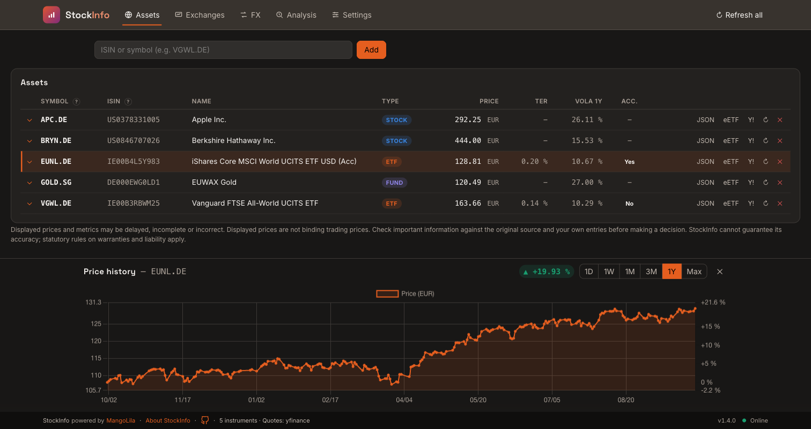
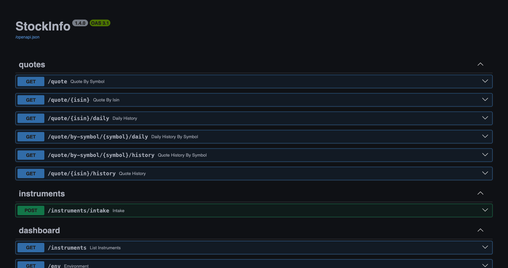

# StockInfo

Stock and ETF quotes, price history and a web dashboard in one container.
StockInfo fetches market data from Yahoo Finance and justETF, resolves ISINs
with OpenFIGI, and caches results in SQLite. The dashboard supports English
and German; the REST API returns JSON for use by other applications.

**GitHub:** [MikeMitterer/stockinfo — source code and documentation](https://github.com/MikeMitterer/stockinfo)

**No login:** anyone who can reach StockInfo can change or delete its data.
Do not forward its port to the internet. Use it in a trusted network, reach
that network through a VPN, or put a reverse proxy with HTTPS and a login in
front of it. With StockPortfolio, only LAN and VPN work: its browser calls to
StockInfo carry no login, so a login proxy blocks them.



## Quick start

You need Docker. The image includes the backend, dashboard and dependencies.

```bash
docker run -d \
  --name stockinfo \
  --restart unless-stopped \
  -p 127.0.0.1:8000:8000 \
  -v stockinfo-data:/data \
  mangolila/stockinfo:latest
```

Open **http://localhost:8000/** for the dashboard or
**http://localhost:8000/docs** for the interactive API documentation.

```bash
curl http://localhost:8000/quote/IE00B3RBWM25
```

The example exposes the service only on the Docker host. To reach it from
your trusted LAN, replace `127.0.0.1:8000:8000` with `8000:8000` and use the
host's address in your browser. Keep that port inside your LAN; for remote
access use a VPN or a reverse proxy with HTTPS and a login (see above; with
StockPortfolio only the VPN).

## Docker Compose

Save this as `compose.yaml` in a directory of your choice:

```yaml
services:
  stockinfo:
    image: mangolila/stockinfo:latest
    restart: unless-stopped
    ports:
      - "127.0.0.1:8000:8000"
    volumes:
      - stockinfo-data:/data
    environment:
      TZ: Europe/Vienna
      DEFAULT_EXCHANGE: XETR
      CACHE_TTL_HOURS: "6"
      REFRESH_INTERVAL_HOURS: "6"

volumes:
  stockinfo-data:
```

Start it with `docker compose up -d`. This is an alternative to the
`docker run` example; Compose creates its own project-scoped data volume.

## What you get

- Stock and ETF quotes by ISIN or symbol and exchange.
- Cached prices, automatic refreshes and historical price charts.
- ETF metadata such as TER, provider and fund size when the source supplies it.
- Manual values for metadata that the sources do not provide.
- A dashboard for managing instruments, viewing charts and configuring sources.
  A short note below the asset list states the limits of the displayed data.
- An **About** tab under Settings, also linked from the status bar, explains the
  limits of displayed data and links to the EUPL and consumer declaration.
  It also links to MangoLila's separate notice for website financial content
  and shows MangoLila GmbH's logo, postal address and website link beside the
  About text. On narrow screens, a section selector replaces the tab row.
- A REST API on the same port as the dashboard.



Online sources need outbound internet access and can impose rate limits or
return incomplete data. Source chains are configurable; a bundled YAML-file
source also supports manually maintained data.

## Storage and permissions

Mount persistent storage at **`/data`**. It contains the SQLite database
(`/data/stockinfo.db`), source configuration and other application data.
Keep this volume when replacing or updating the container.

For a host directory instead of a named volume, use a mount such as
`-v /srv/stockinfo:/data`. Mount a directory dedicated to StockInfo.

The container starts as root only to prepare `/data`, then runs the
application as **UID 99 / GID 100** (Unraid's `nobody:users`). Change these
IDs with `PUID` and `PGID`, for example to the owner of an existing host
directory. The entrypoint changes ownership only when files belong to someone
else. Before the app starts, it checks that `/data` and an existing database
are writable for the target user:

- If ownership cannot be changed (for example on NFS/SMB), it logs a warning
  and continues when the directory is still writable.
- If the directory or database is not writable, or the container lacks the
  `SETUID`/`SETGID` capabilities, it stops with a message naming the path,
  the IDs and the fix.
- With `--user UID:GID` it skips the ownership step and only checks that
  `/data` is writable for that user.

Source chains live in `/data/sources.yaml` and are loaded at startup. Restart
the container after editing them. See the [source configuration guide](../docs/plugins.md)
for file-based sources and plugins; paths described there beside the database
belong under `/data` in the container.

## Configuration

Pass settings with `docker run -e NAME=value`, an `--env-file`, or Compose's
`environment` section. Restart/recreate the container to apply changed settings.

| Variable | Default | Purpose |
|---|---|---|
| `TZ` | Container default | Timezone, for example `Europe/Vienna` |
| `PUID` / `PGID` | `99` / `100` | User and group IDs for the app and `/data`; not `0` |
| `CACHE_TTL_HOURS` | `6` | Quote age that triggers a refresh on request |
| `REFRESH_INTERVAL_HOURS` | `6` | Background refresh interval |
| `METADATA_TTL_DAYS` | `7` | ETF metadata refresh interval |
| `DEFAULT_EXCHANGE` | `XETR` | Preferred exchange for ISIN queries (MIC code) |
| `STRICT_EXCHANGE` | `false` | Require that exchange during ISIN resolution |
| `FX_TTL_HOURS` | `1` | Exchange-rate cache lifetime |
| `OPENFIGI_API_KEY` | Empty | Optional key for a higher OpenFIGI rate limit |

The container listens on **port 8000**. To use a different host port, change
only the left-hand port in the mapping, for example `127.0.0.1:8080:8000`.
Dashboard and API share an origin; no separate frontend container is needed.

## Updates, backups and troubleshooting

For Compose installations:

```bash
docker compose pull
docker compose up -d
docker compose logs --tail=100 stockinfo
```

For `docker run` installations, pull the new image, stop and remove the old
container, then repeat your original run command with the **same data mount**.
Use a versioned image tag instead of `latest` if you want to pin a release.
Available tags are listed on Docker Hub.

Back up the whole `/data` volume before updating. For a filesystem copy, stop
the container first so that the SQLite database and its journal files stay
consistent. Keep the backup outside the container and its data volume.

For the `docker run` example, view logs with `docker logs --tail=100 stockinfo`.
The image includes a healthcheck against `/operational`; `/health` checks that
the process is running, and `/ready` reports whether normal requests are allowed.
If the service waits for a migration or reports a source error, inspect the
logs and dashboard before restarting repeatedly.

## Unraid

See the [Unraid guide](../unraid/README.md) for installation, configuration and operation.

## Support and license

- [Report a problem](https://github.com/MikeMitterer/stockinfo/issues)
- [Source code and full documentation](../README.md)
- [Release notes](../docs/release-notes.md)
- [Changelog by release tag](../CHANGELOG.md)
- [License: EUPL 1.2 only](../LICENSE)

The dashboard's **Settings → About** tab links to the English or German EUPL
according to the selected UI language. It also links to the consumer
declaration. Displayed data may be incomplete or outdated; check important
figures against their original sources.
MangoLila's linked financial content notice addresses its website and
publications; the app's license and consumer declaration remain separate.

StockInfo permits personal and commercial use, modification, redistribution,
sale and hosting under the EUPL without an additional paid license. Preserve
notices and provide the corresponding source as required by the license,
including for covered network services. Image tags identify the source commit
in the [source repository](https://github.com/MikeMitterer/stockinfo).

Copyright © 2026 Michael Mitterer; provider and licensor: MangoLila GmbH.
See [licensing, source and the consumer declaration](../LICENSING.md).
The image includes `/app/LICENSE`, `/app/LICENSE.de.txt` and `/app/LICENSING.md`.
The independent plugin API and example plugin retain their MIT licenses at
`/app/plugin_api/LICENSE` and `/app/plugin_api/examples/us-example/LICENSE`.
Third-party components retain their own licenses.
