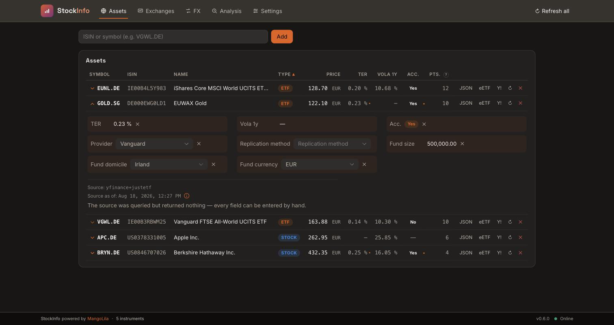

# Earlier release notes

[Current README](../README.md)

- [1.0.0](#whats-new-in-100)
- [0.6.0](#whats-new-in-060)

## What's new in 1.0.0

- StockInfo's application code is now licensed under the
  [AGPL-3.0-or-later](../LICENSE). The independent plugin API remains under the
  [MIT license](../plugin_api/LICENSE); commercial terms are available separately.
- `make build` includes and checks the license texts in the Docker image.
  `make push` accepts only the checked image from the current source commit.
- The Docker source-profile command writes to the named volume used by
  `make up`, including before the first container start.

## What's new in 0.6.0

- **All eight ETF metrics are maintainable by hand** — provider, replication,
  fund size, fund domicile and fund currency join TER, volatility and
  accumulating. Maintained in an expandable detail area per row, not in the
  table cell.

  

- **Stored metrics survive an outage.** A failed justETF request no longer wipes
  what was already there — "asked and empty" is now distinguishable from "could
  not ask". `METADATA_TTL_DAYS` finally does what it always claimed: justETF is
  scraped once per cycle instead of on every quote.
- **Merging duplicate instruments no longer loses data.** Manual values and the
  daily-sync watermark move to the surviving row instead of being cascaded away.
- **Three probes, three questions.** `/health` stays cheap (is the process
  alive?), `/ready` actually touches the database (is normal operation
  released?), and the new `/operational` answers what the Docker healthcheck
  needs (can the process do its current job?). A pending migration is not a
  fault — `/ready` says `503`, `/operational` stays `200`.
- **The identity migration is a mandatory, two-phase flow.** On startup the
  service works out what a migration would cost, blocks every business route
  and shows the list; only an explicit confirmation runs it. Instruments whose
  symbol cannot be split into ticker and exchange leave the portfolio and are
  named in the report instead of being guessed.
- **Stricter API contract** — symbols and time ranges are validated (`422`
  instead of a wrong result), and an unresolvable ISIN answers `404` instead of
  `502`.
